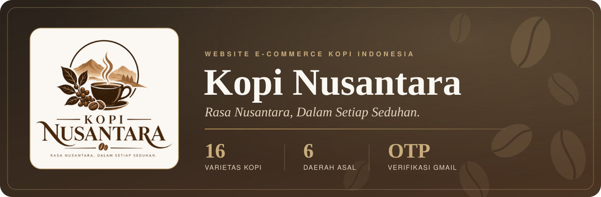
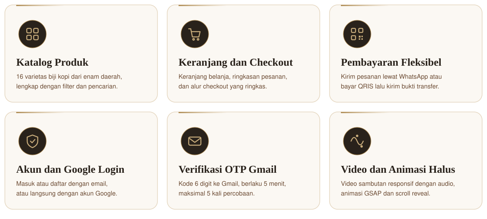
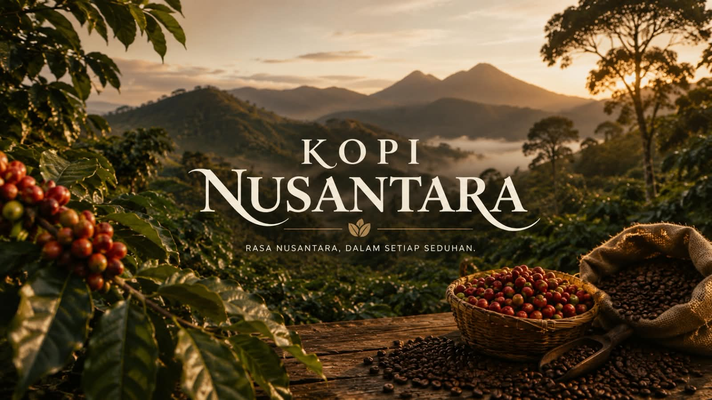
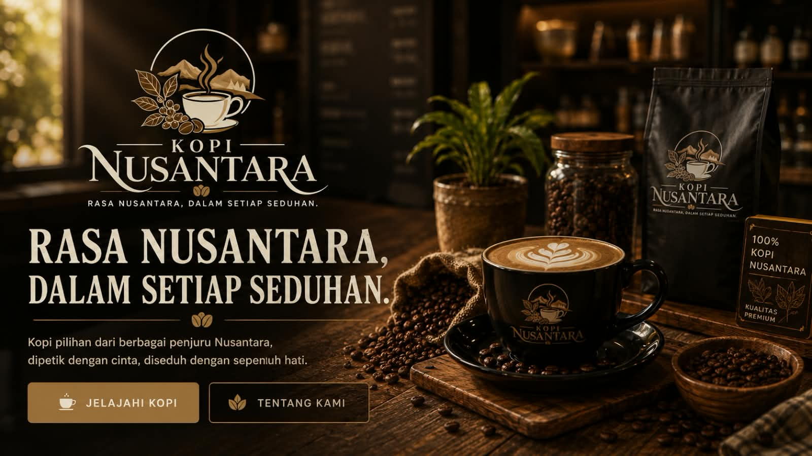
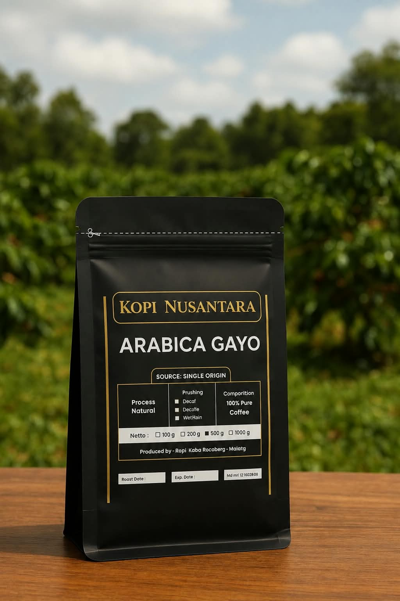
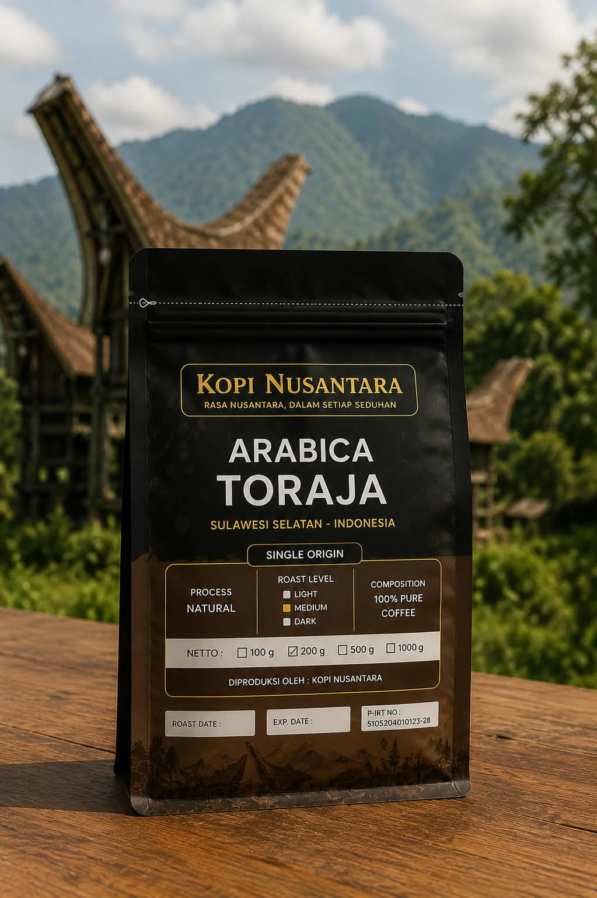
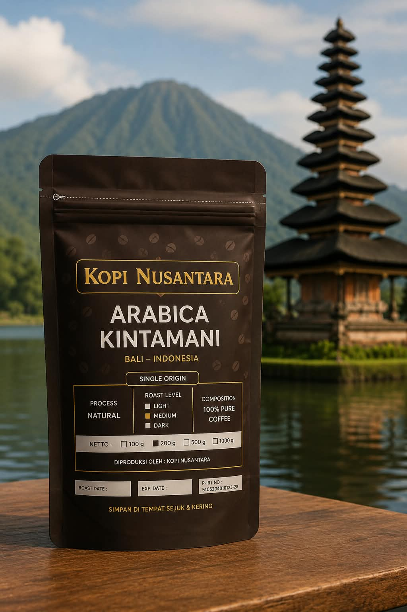
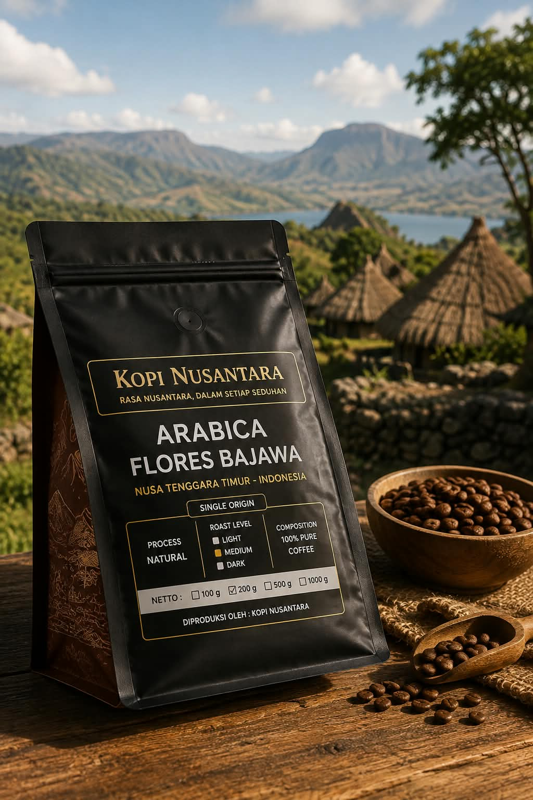
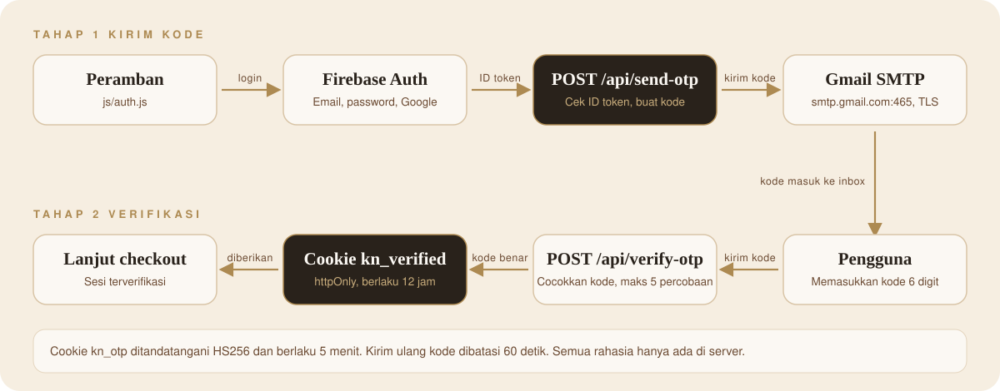

<div align="center">



<br><br>

<a href="https://www.kopi-nusantara.biz.id/">
  
</a>

<br><br>

[Ringkasan](#ringkasan) &nbsp;|&nbsp; [Fitur](#fitur-utama) &nbsp;|&nbsp; [Galeri](#galeri) &nbsp;|&nbsp; [Alur Auth](#alur-autentikasi-dan-otp) &nbsp;|&nbsp; [Teknologi](#teknologi-dan-platform) &nbsp;|&nbsp; [Struktur](#struktur-proyek) &nbsp;|&nbsp; [Menjalankan](#menjalankan-secara-lokal) &nbsp;|&nbsp; [Developer](#developer)


</div>

## Ringkasan

**Kopi Nusantara** adalah website e-commerce biji kopi pilihan dari berbagai daerah Indonesia. Pengunjung dapat menjelajahi asal-usul kopi, memilih dari 16 varietas, memasukkannya ke keranjang, lalu menyelesaikan pesanan lewat WhatsApp atau QRIS.

Situs dibangun tanpa framework: HTML, CSS, dan JavaScript murni di sisi klien, dengan Firebase untuk akun pengguna dan fungsi serverless kecil untuk verifikasi OTP lewat Gmail. Fokus desainnya adalah tampilan hangat bernuansa espresso dan krem, animasi yang halus, serta layar masuk berbasis video yang responsif di mobile maupun desktop.

<div align="center">

</div>

## Fitur Utama

<div align="center">

</div>

<br>

- **Katalog produk**: 16 varietas dari Aceh, Sulawesi, Bali, Nusa Tenggara, Jawa Barat, dan Sumatera Utara, dengan filter daerah dan pencarian.
- **Keranjang dan checkout**: ringkasan pesanan dan subtotal dalam Rupiah, lalu pilih metode pembayaran.
- **Dua metode pembayaran**: pesan lewat WhatsApp dengan teks pesanan yang sudah tersusun, atau bayar via QRIS lalu kirim bukti pembayaran.
- **Akun pengguna**: daftar dan masuk dengan email dan password, atau dengan Google. Sesi tetap tersimpan setelah halaman dimuat ulang.
- **Layar masuk berbasis video**: video terpisah untuk mobile dan desktop dengan audio, tampil 16:9 penuh tanpa terpotong. Di mobile, form Masuk muat satu layar dan form Daftar dapat di-scroll dengan rapi.
- **Animasi halus**: GSAP dan ScrollTrigger sebagai lapisan tambahan, dengan fallback scroll reveal berbasis IntersectionObserver bila skrip gagal dimuat, serta menghormati pengaturan reduced motion.
- **Konten lengkap**: hero, tentang, profil, asal kopi, visi dan misi, kios, lokasi dengan peta, jurnal kopi, dan ulasan pelanggan.

<div align="center">

</div>

## Galeri

<table>
  <tr>
    <td width="33%"></td>
    <td width="33%"></td>
    <td width="33%"></td>
  </tr>
  <tr>
    <td align="center"><sub>Tentang</sub></td>
    <td align="center"><sub>Pilihan biji</sub></td>
    <td align="center"><sub>Asal: Toraja</sub></td>
  </tr>
</table>

<table>
  <tr>
    <td width="25%"></td>
    <td width="25%"></td>
    <td width="25%"></td>
    <td width="25%"></td>
  </tr>
  <tr>
    <td align="center"><sub>Gayo Arabika</sub></td>
    <td align="center"><sub>Toraja Sapan</sub></td>
    <td align="center"><sub>Kintamani Citrus</sub></td>
    <td align="center"><sub>Flores Bajawa</sub></td>
  </tr>
</table>

<div align="center">

</div>

## Alur Autentikasi dan OTP

Login ditangani Firebase Authentication di sisi klien. Verifikasi OTP berjalan di fungsi serverless tanpa dependensi npm: ID token Firebase diverifikasi langsung terhadap kunci publik Google, dan status OTP disimpan di cookie bertanda tangan, bukan di database.

<div align="center">

</div>

<br>

| Parameter | Nilai |
| --- | --- |
| Panjang kode OTP | 6 digit |
| Masa berlaku kode | 5 menit |
| Jeda kirim ulang | 60 detik |
| Maksimal percobaan | 5 kali |
| Masa berlaku status terverifikasi | 12 jam |
| Cookie | `kn_otp` (kode aktif), `kn_verified` (terverifikasi), keduanya ditandatangani HS256 |
| Alamat yang didukung | Gmail (`@gmail.com`), diambil dari ID token yang sudah diverifikasi, bukan dari input pengguna |

| Endpoint | Fungsi |
| --- | --- |
| `POST /api/send-otp` | Verifikasi ID token, buat kode, kirim lewat Gmail SMTP |
| `POST /api/verify-otp` | Cocokkan kode dengan cookie `kn_otp`, lalu set `kn_verified` |
| `GET /api/check-verified` | Cek status verifikasi (hanya baca), memakai header `Authorization: Bearer <idToken>` |

<div align="center">

</div>

## Teknologi dan Platform

<div align="center">

<sub><b>FRONT-END</b></sub><br>


<br><br>
<sub><b>AUTH DAN DATA</b></sub><br>


<br><br>
<sub><b>SERVERLESS API</b></sub><br>


<br><br>
<sub><b>DEPLOY DAN SEO</b></sub><br>


<br><br>
</div>

<br>

| Platform / layanan | Peran dalam proyek |
| --- | --- |
| Firebase Authentication | Daftar, masuk email dan password, Google Sign-In, persistensi sesi |
| Cloud Firestore | Profil pengguna pada koleksi `users` |
| Vercel (fungsi serverless) | Menjalankan folder `api/` untuk pengiriman dan verifikasi OTP |
| Gmail SMTP | Pengiriman email kode verifikasi (port 465, TLS) |
| GitHub dan GitHub Actions | Repositori, serta workflow deploy ke GitHub Pages |
| WhatsApp (`wa.me`) | Tujuan pesanan dengan teks yang sudah tersusun |
| QRIS | Pembayaran non-tunai dengan bukti dikirim via WhatsApp |
| Google Maps (embed) | Peta lokasi pusat |
| Google Search Console | Verifikasi kepemilikan situs |
| Google Fonts, jsDelivr, cdnjs, gstatic | Font Cormorant Garamond dan DM Sans, Bootstrap, GSAP, Firebase SDK |

**Palet dan tipografi**

| Token | Warna |
| --- | --- |
| Espresso | `#29221B` |
| Coffee | `#4B3423` |
| Cream | `#F6EEE1` |
| Beige | `#E4D5BE` |
| Gold | `#AD8A52` |
| Off-white | `#FBF8F3` |

Judul memakai **Cormorant Garamond**, teks isi memakai **DM Sans**.

<div align="center">

</div>

## Struktur Proyek

```text
kopi-nusantara/
├── index.html                 Halaman utama dan markup layar auth
├── style.css                  Seluruh gaya, termasuk layar auth responsif
├── script.js                  Produk, keranjang, checkout, filter, carousel
├── motion.js                  Lapisan animasi GSAP dan ScrollTrigger
├── js/
│   ├── firebase-init.js       Inisialisasi Firebase (App, Auth, Firestore)
│   └── auth.js                Login, daftar, Google, OTP, kontrol video auth
├── api/
│   ├── send-otp.js            Kirim kode OTP
│   ├── verify-otp.js          Verifikasi kode OTP
│   ├── check-verified.js      Cek status verifikasi
│   └── lib/
│       ├── crypto-jwt.js      JWT HS256 dengan crypto bawaan Node
│       ├── firebaseAuth.js    Verifikasi ID token Firebase
│       ├── mailer.js          SMTP Gmail lewat TLS
│       └── session.js         Cookie sesi OTP
├── assets/
│   ├── images/                Foto produk, asal kopi, kios, blog, logo
│   ├── videos/                auth-mobile, auth-desktop, footer
│   ├── developer/             Foto developer
│   └── readme/                Aset SVG untuk README ini
├── .github/workflows/pages.yml
├── robots.txt
└── sitemap.xml
```

<div align="center">

</div>

## Menjalankan Secara Lokal

Bagian tampilan cukup dijalankan dengan server statis apa pun. Modul ES (`js/auth.js`) tidak berjalan lewat `file://`, jadi gunakan server lokal.

```bash
# opsi 1: Python
python3 -m http.server 8000

# opsi 2: Node
npx serve .
```

Buka `http://localhost:8000`.

Untuk mencoba OTP secara lokal, jalankan bersama fungsi serverless:

```bash
npx vercel dev
```

Pada Firebase Console, pastikan `localhost` dan domain produksi ada di **Authentication, Authorized domains** agar Google Login berjalan.

## Variabel Lingkungan

Semua rahasia hanya dipakai di server (folder `api/`) dan tidak pernah dikirim ke klien. Berkas `.env` sudah masuk `.gitignore`.

| Variabel | Wajib | Keterangan |
| --- | --- | --- |
| `GMAIL_USER` | Ya | Alamat Gmail pengirim OTP |
| `GMAIL_APP_PASSWORD` | Ya | App Password Gmail (bukan password akun) |
| `SESSION_SECRET` | Ya | Kunci penanda tangan cookie, minimal 16 karakter |
| `FIREBASE_PROJECT_ID` | Tidak | Bawaan: ID proyek Firebase yang dipakai situs |

## Deployment

- Workflow `pages.yml` men-deploy isi repositori ke GitHub Pages setiap push ke cabang `main`, dan dapat dijalankan manual.
- Fungsi di `api/` memerlukan runtime serverless (Vercel). Isi variabel lingkungan di dashboard layanan tersebut.
- Situs dilayani di `https://www.kopi-nusantara.biz.id/`.

**SEO**: meta description dan Open Graph, data terstruktur Schema.org (`Store`), `robots.txt`, `sitemap.xml`, serta berkas verifikasi Google Search Console.

<div align="center">

</div>

## Developer

<table>
  <tr>
    <td width="200" align="center" valign="top">
      
    </td>
    <td valign="top">
      <h3>[Nama Developer]</h3>
      <p>[Peran, contoh: Pengembang Website]</p>
      <p>
        GitHub: <a href="https://github.com/username">github.com/username</a><br>
        Email: <a href="mailto:email@contoh.com">email@contoh.com</a>
      </p>
    </td>
  </tr>
</table>

## Kontak Bisnis

| | |
| --- | --- |
| Email | halo@kopinusantara.id |
| WhatsApp | +62 851-2210-8079 |
| Situs | https://www.kopi-nusantara.biz.id/ |

<div align="center">


<sub>Kopi Nusantara. Rasa Nusantara, Dalam Setiap Seduhan.</sub>

<sub>Hak cipta dilindungi. Konten, logo, dan aset visual tidak boleh digunakan ulang tanpa izin.</sub>

</div>
